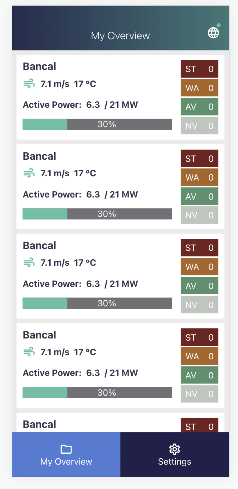

# Fullstack web app RWE

This project displays an overview of windfarm data built with a React Frontend with TypeScript and a Node Backend with Express.

## How to get started

Install all dependencies in the backend and frontend folder.

## Start the backend

To start the backend on port 5000 run 

### `node app.js`

## Start the frontend

In a new terminal window start the project with 

### `npm start`

Open [http://localhost:3000](http://localhost:3000) to view it in the browser.

The app was only build for mobile view.

It should look like this:

